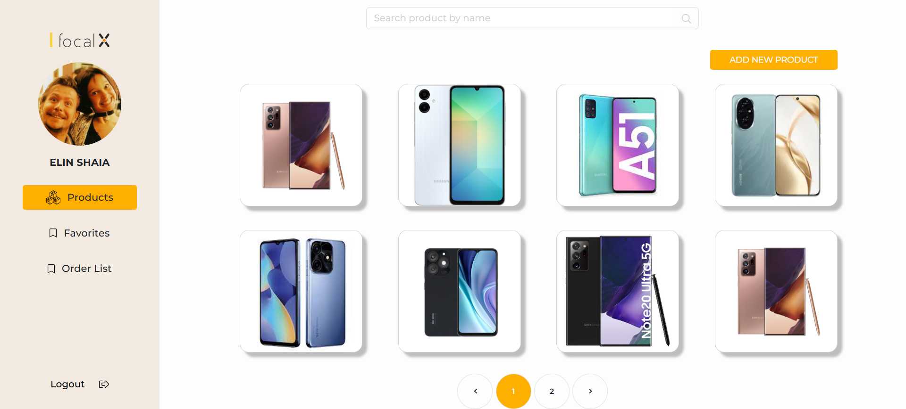

# Admin Dashboard

A responsive and simple Admin Dashboard built with **React**, **TypeScript**, and **React Bootstrap**. This dashboard allows admins to manage products and user access easily.

 

## ✨ Features

- ✅ View all products
- 📝 Edit products
- ❌ Delete products
- ✅ Add Products
- 📄 Generate product reports (Excel format)
- 🔐 User authentication:
  - Sign up
  - Log in
  - Log out

## 🛠️ Technologies Used

- **React**
- **TypeScript**
- **React Bootstrap**
- **RESTful API**

## 📦 Main Libraries

- [`axios`](https://www.npmjs.com/package/axios) – For handling HTTP requests  
- [`react-bootstrap`](https://react-bootstrap.github.io/) – For UI components and layout  
- [`file-saver`](https://www.npmjs.com/package/file-saver) – For downloading Excel reports  
- [`xlsx`](https://www.npmjs.com/package/xlsx) – For creating Excel files from data  
- [`react-router-dom`](https://www.npmjs.com/package/react-router-dom) – For routing between pages  
- [`gh-pages`](https://www.npmjs.com/package/gh-pages) – For deploying the app to GitHub Pages  


## ⚙️ Installation & Running Locally

1. Clone the repository:

   ```bash
   git clone https://github.com/your-username/your-repo-name.git
   cd your-repo-name
2. Install dependencies:
   ```bash
   npm i
   npm run dev

## ⚙️ Contact
For questions, suggestions, or collaborations:

elinshaia23@gmail.com
Made with 💙 by Ellin Shaia
